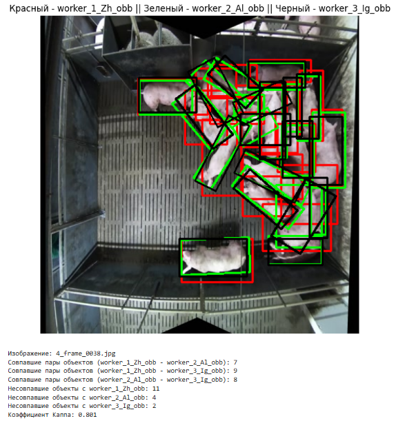

# itmo_data_in_ml_2025

## Модуль 3. Разметка данных

### Defenition of done

- Возьмите открытый табличный датасет, набор текстовых данных(например, отзывы о продукте) или набор изображений(можно взять из открытых источников).
    - есть опция, что можете взять, то что было в первом дз
- Напишите ТЗ (в свободной форме) для разметки выбранного датасета. (Для текстового датасета можно предложить разметку семантики, для набора изображений – детекцию или сегментацию). Не забывайте про примеры в ТЗ!
- Добавьте какой-либо валидатор (принимаются подмешивание тестовых кейсов/рассчет метрики согласованности – в этом случае нужно будет предостаивть разметку от минимум 2х людей).
- Отправьте ваш собранный (но неразмеченный!) датасет знакомому с курса и предложите разметить по вашему ТЗ. **Получите обратную связь.**
Для разметки допустимо использовать одну из онлайн-платформ или самостоятельные инструменты (предоставьте инструмент вашему разметчику).
- Проанализируйте полученные результаты разметки на наличие выбросов/дубликатов/некорректных результатов. Примените методы для их коррекции или удаления. Оцените метрику согласованности, либо квалификацию вашего разметчика на подмешанных тестовых кейсах.
- Порефлексируйте на тему процесса разметки данных и качества полученных результатов.

## Решение

### **1. Подготовка датасета**
1. Нарезка изображений из видео, каждый 10-й кадр
2. Отбор только уникальных изображений (автоматический + ручной отбор) --> 100 изображений
3. Дополнительная проверка на наличие дубликатов через hash

### **2. Разметка изображений**
Установка `Label Studio` --> [Документация](https://labelstud.io/guide/quick_start), [YouTube](https://youtu.be/A0cob_f5BmM?si=B-TorNljYvv4npas)
 
### **3. Подготовка материалов для разметчиков**
1. Написание инструкции (ТЗ) --> `instruction_for_detection.md`
2. Подготовка двух датасетов из 20 изображений с 5-ю подмешанными уже размеченными изображениями (для проверки качества разметки) --> `images_for_labeling_1.zip`

### **4. Работа с разметчиками**
1. Получение результатов разметки
2. Сбор обратной связи, анализ и выявление проблемных мест

```
ОС 1:
В целом все отлично, только я бы в инструкции сделал так, чтобы шло предложение, и сразу после него скрин примера был, а не блок предложений, а потом блок скринов. Остальное все норм. Проблем не было. Все было понятно.

ОС 2:
Очень понятная инструкция в плане работы с системой разметки Label Studio. Есть несколько примеров разметки. Однако, непонятно зачем в инструкции цвет для объектов, если разметка идет у себя локально и тебе мы присылаем только готовую разметку в формате YOLO).
Мне больше не хватило уточнений касательно данных. Мы размечаем в режиме oriented bbox, а именно bbox с поворотом. Хотелось бы точнее знать, на что ориентироваться при повороте bboxа. При разметке я ориентировалась на спину свинок, но в целом, если у нам на проекте много асессоров, то каждый может по-своему понять, как нужно выбирать угол поворота прямоугольника, что может привести к неоднозначности разметки. Ну и не было понятно, что делать в ситуациях, когда видно только какую-то непонятную часть свинки (кусок спины только, например). Ещё один момент - непонятно сначала было в какой области отмечать свинок (только в центральной части экрана, а тех, что под заборчиком не нужно отмечать).
Но в целом, задание очень интересное, хоть и местами трудное (там, где куча свинок 🤯). Спасибо за интересное задание).

ОС 3:
1. Всё понятно и просто, надеюсь выполнил как надо.
2. Инструмент не для тревожных людей, нет сбрасывания квадратика на правую кнопку.
3. Свиньи тощие. С них супа не сваришь.

Дополнительно от себя:
Упущен момент с авторизацией в Label Studio в инструкции.
Упущен момент с выгрузкой данных в формате ориентированных oriented bbox. Потребовалось сделать повторный запрос на выгрузку.
```

### **5. Валидация разметки**
1. Проверка разметки на наличие ошибок, пропусков
2. Сравнение разметки с эталоном с помощью метрики IoU (Intersection over Union)
3. Проверка согласованности между разметчиками с помощью метрики **Cohen’s Kappa**

```
Золотой стандарт
images/images_for_labeling_1/1_frame_0020.jpg
images/images_for_labeling_1/1_frame_0038.jpg
images/images_for_labeling_1/2_frame_0002.jpg
images/images_for_labeling_1/2_frame_0026.jpg
images/images_for_labeling_2/2_frame_0044.jpg
```



### **6. Подведение итогов**

Для решения задачи детекции свинюшек и людей была проведена разметка данных с использованием `OBB (Oriented Bounding Boxes)` в инструменте `Label Studio`. Инструмент досточно легкий в освоении и не вызвал трудностей у разметчиков.

Инструкция была составлена в целом неплохо, но был ряд моментов, которые вызвали вопросы у разметчиков. Например, момент авторизации. Большим промахом стало отсутствие разъяснений в части непосредственной разметки (выделения границ объектов), а также выгрузки данных в необходимом формате.

Несмотря на это, разметка была проведена успешно. Разметчики показали хороший уровень согласованности, особенно второй и третий. У первого наблюдается неверное интерпретирование границ объектов, что требует дополнительного разъяснения. Подробный анализ можно посмотреть в файле `check_labeling.ipynb`.

## Дальнейшие улучшения
 - Скорректировать инструкцию в части разметки и выгрузки данных.
 - Дать дополнительные разъяснения разметчикам.
 - Довести попытку подключения предразметки на платформе (например, с помощью модели YOLOv8) до конца, чтобы ускорить процесс разметки.
