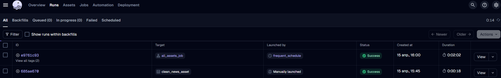
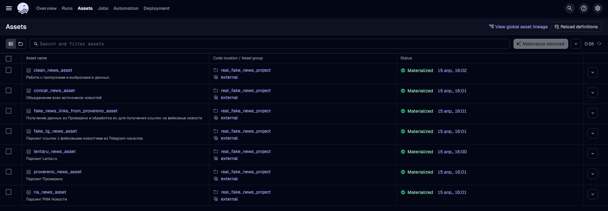

# Пайплайн обработки данных для обнаружения фейковых новостей на платформе Dagster

В эпоху цифровых технологий и быстрого распространения информации проблема фейковых новостей становится одной из самых острых среди социальных и технологических вызовов. Фейковые новости подрывают доверие к медиа, формируют поляризацию общества и даже влияют на политические решения. 

Автоматическое обнаружение фейковых новостей с использованием современных технологий машинного обучения и искусственного интеллекта позволяет противостоять этому явлению, обеспечивая прозрачность и достоверность информации.

Для создания высокоточных моделей машинного обучения необходимо собирать качественные данные, в сжатые сроки и с минимальными затратами усилий. В этом отлично может помочь платформа [Dagster](https://dagster.io/), которая позволяет настраивать гибкие и масштабируемые пайплайны, помогая автоматизировать процесс обработки данных.


## Важность оформления обработки данных в единый пайплайн

Создание единого пайплайна для обработки данных является ключевым шагом в построении эффективной и масштабируемой системы анализа информации. Наличие пайплайна дает ряд преимуществ.

- **Автоматизация рутинных процессов**. Сбор → разметка → очистка →  → сохранение.

- **Воспроизводимость результатов**. Каждый этап обработки данных становится прозрачным и легко воспроизводимым.

- **Повышение качества данных**. Единая система контроля данных минимизирует риск ошибок и потери информации на каждом этапе обработки.

- **Скорость реагирования и ускорение разработки**. Готовые модули для каждого этапа позволяют сосредоточиться на улучшении модели, ее быстрому обновлению и внедрению.

- **Масштабируемость**. Пайплайн легко адаптируется для работы с увеличивающимися объемами данных и новыми источниками информации.

- **Снижение затрат**. Оптимизация процессов позволяет экономить ресурсы и время, что особенно важно в условиях ограниченного бюджета.

Для задачи детекции фейковых новостей пайплайн должен включать шаги от сбора сырых данных до формирования финального датасета для обучения модели.


## Ключевые этапы пайплайна

### 1. Сбор и разметка данных по источнику

- Получение сырых текстовых данных из разных источников в две стадии:
    - Стадия 1
        - РИА Новости
        - Lenta.ru
        - Provereno.media
    - Стадия 2
        - Обработка выгруженных ссылок и фильтрация только для фейковых новостей
        - Получение сырых данных по ссылкам (Фейковые новости через tgstat)

> [!NOTE]  
> Разметка происходит на данном этапе по источнику данных.

### 2. Объедение данных

- Объединение данных из разных источников в один датасет

### 3. Обработка данных

- Работа с данными:
    - Выделение источника новостей отдельным признаком `source`
    - Преобразрование данных в единый формат (`datetime`, `views`)
    - Удаление строк, где в `full_text`, `date_published` пустые
    - Удаление дубликатов    
    - Заполнение пропусков в данных:
       - `title` - через суммаризацию основного текста с помощью LLM-модели `mT5_multilingual_XLSum`
       - `tags` - через тематическое моделерование с помощью LDA
       - `views` - медианой
    - Обработка выбросов:
        - Удаление новостей с просмотрами больше 1 млн.
        - Сокращение длинных текстов и удаление слишком длинных текстов

### 5. Сохранение очищенных и размеченных данных

- Сохранение данных в формате `.csv`

### 6. Подключение расписания

В рамках тестирования используется расписание `cron_schedule="*/5 * * * *"`, то есть запуск пайплайна каждые 5 минут. Также уменьшены объеммы парсинга для ускорения процесса отладки.

> [!NOTE] 
> На каждом этапе выполняется логирование и сохранение промежуточных датасетов для предотвращения потери данных в случае ошибок парсинга.

### 7. Дальнейшие улучшения

1. Реорганизация структуры проекта и кода, вынесение например источников в ресурсы
2. подключение базы данных для хранения данных
3. Написание дополнительных исключений для обработки ошибок


## Структура проекта

```
dagster_real_fake_news/
└── real_fake_news_project/
    ├── data                               # Папка для выгрузки данных
    │   ├── dagster_storage/               # Папка с данными из ассетов
    │   │   ├── ria_news_asset
    │   │   └── ...
    │   ├── real_fake_news_processed.csv
    │   └── ...
    ├── external_scripts/                  # Скрипты для парсинга
    │   ├── __init__.py
    │   ├── get_ria_news.py
    │   └── ...
    ├── real_fake_news_project/            # Основная папка проекта
    │  ├── __init__.py
    │  ├── assets/
    │  │   ├── __init__.py
    │  │   └── assets.py                   # Прописаны ассеты, расписание и job
    │  ├── __init__.py
    │  └── definitions.py                  # Определены все компоненты проекта
    ├── real_fake_news_project_tests/
    ├── pyproject.toml
    ├── requirements.txt                   # Файл с зависимостями
    ├── setup.cfg       
    ├── setup.py  
    ├── .gitignore  
    ├── repo_images/
    └── README.md 
```

## Пример работы пайплайна






## Запуск проекта

Склонируйте репозиторий

```python
git clone <repository_url>
cd /dagster_real_fake_news/real_fake_news_project
```

Установите зависимости (в проекте используется `conda`-окружение)

```python
pip install -r requirements.txt
```

Запустите Dagster UI

```python
dagster dev
```

Откройте http://localhost:3000

Пайплайн можно запустить вручную
```python
dagster job execute -m real_fake_news_project.definitions -j all_assets_job
```
