# Инструкция по разметке изображений для детекции людей и свинок

## Цель
Цель данной инструкции — предоставить пошаговое руководство по разметке изображений для детекции людей и свинок в программе `Label Studio`. Разметка необходима для обучения моделей машинного обучения семейства `YOLO`, которые могут автоматически обнаруживать и классифицировать объекты на изображениях.

## Шаги разметки

### 1. Подготовка
- **Датасет**: Скачайте архив с изображениями `images.zip` и распакуйте его. Убедитесь, что изображения имеют формат `.jpg` и содержат 20 штук.
- **Установка программного обеспечения для разметки**: Для выполнения задания необходимо использовать инструмент `Label Studio`.

### 2. Установка и запуск Label Studio на Linux

Вам потребуется любимая IDE, например `VSCode`, а также `Python` и `pip`.
- **Создание виртуального окружения**: Для создания окружения используйте ваши предпочтения, например `venv` или `conda`.
- **Установка Label Studio**: Выполните команду: 

```bash
pip install label-studio
```
Если у вас другая операционная система или вы хотите установить Label Studio в `Docker`, то можете воспользоваться официальной документацией по ссылке: [Label Studio](https://labelstud.io/guide/install)

- **Запуск Label Studio**: Выполните команду: 

```bash
label-studio
```

- **Переход в веб-интерфейс**: Перейдите по ссылке `http://localhost:8080` в вашем браузере.

### 3. Работа в интерфейсе Label Studio

- **Создание проекта**: Нажмите на кнопку `Create Project`
    - на вкладке `Project Name` укажите название проекта
    - на вкладке `Data Import` загрузите разархивированные изображения
    - на вкладке `Labeling Setup` выберите область `Computer Vision` и тип задачи `Object Detection with Bounding Boxes`
    - в открывшемся окне выберите вкладку `Code` и добавьте следующий код:

 ```html
<View>
  <View style="display:flex;align-items:start;gap:8px;flex-direction:column-reverse"><Image name="image" value="$image" zoom="true" zoomControl="true" rotateControl="false"/><RectangleLabels name="label" toName="image" model_score_threshold="0.25" opacity="0.1" showInline="true"> 
  <Label value="person" background="#2b00ff"/><Label value="hog" background="#ff00dd"/></RectangleLabels></View>  
</View>
 ```

- после этого перейдите на вкладку `Visual` и убедитесь, что настройки отображаются корректно (см. скрин ниже)
- нажмите кнопку `Save`

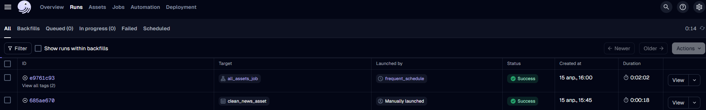

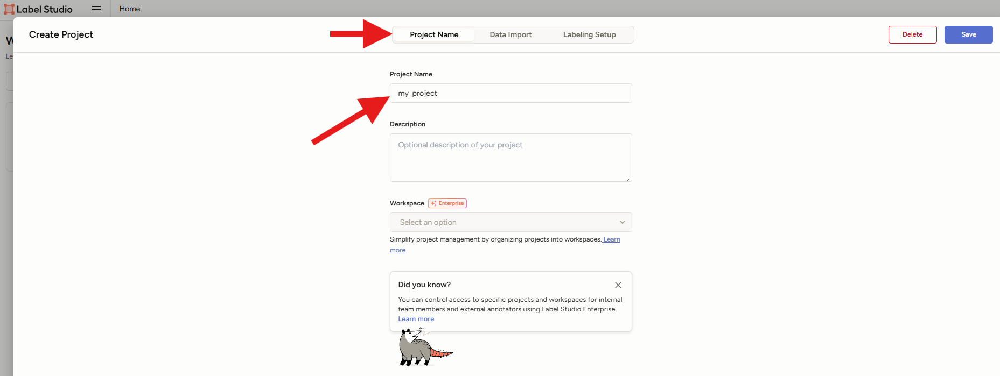
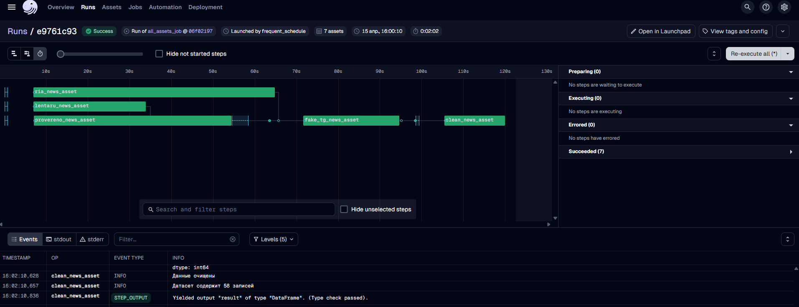
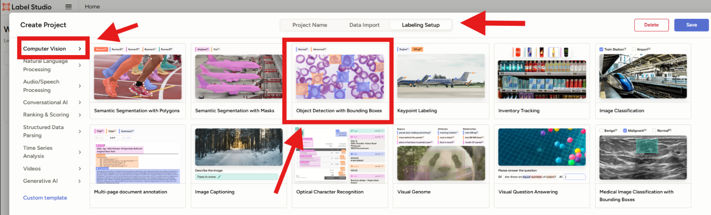
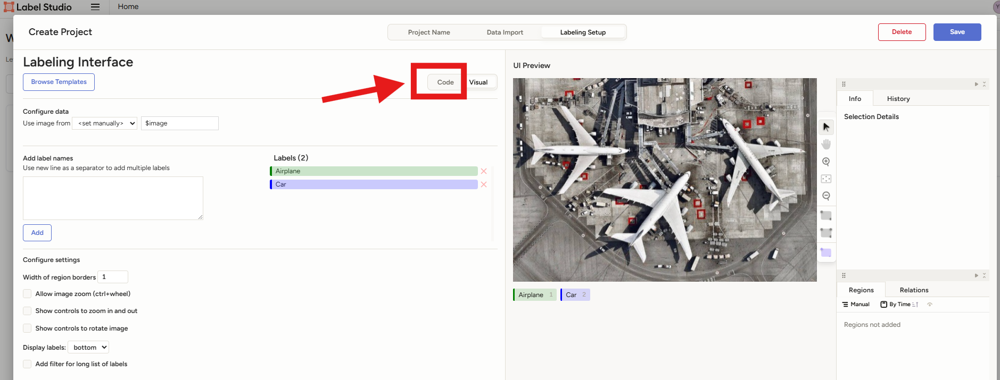
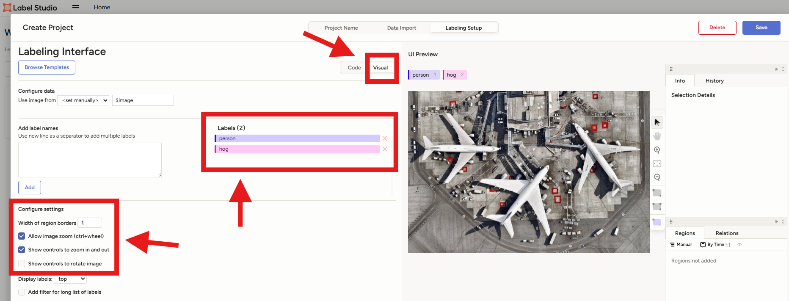
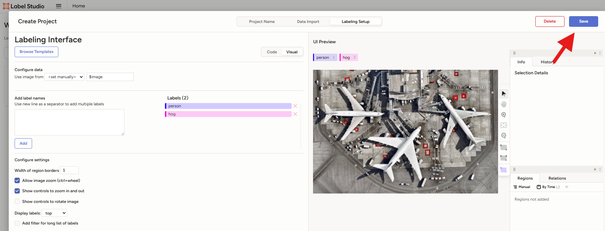


### 4. Разметка изображений

---
- **Ознакомление с правилами разметки**: После блока работы с интерфейсом будет блок с правилами разметки. Пожалуйста, ознакомьтесь с ними, чтобы понимать, как правильно размечать изображения.
---

- **Выбор изображения**: После сохранения настроек проекта откроется рабочее поле с изображенями для разметки. Выберите изображение, которое хотите разметить.

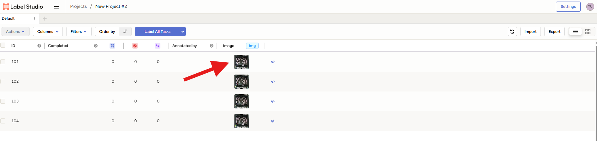

- **Процесс разметки объектов**: Нажмите на класс, который хотите разметить над изображением (например, `person` или `hog`). Затем начните рисовать прямоугольник вокруг объекта на изображении.

Повторное нажатие на прямоугольник дает возможность редактировать его границы и поворачивать.

Через `Ctrl + C` можно скопировать выделенный прямоугольник, через `Ctrl + V` - вставить его, через `Ctrl + X` - вырезать. Через `Ctrl + Z` можно отменить последнее действие. Удалить разметку можно, нажав кнопку `Backspace` на клавиатуре.

Зажав прямоугольник, можно перемещать его по изображению.

Справа на информационной панели можно увидеть количество размеченных объектов каждого класса и их детальные координаты.

![alt text]repo_images/(image_8.png)

- **Сохранение разметки**: После завершения разметки нажмите кнопку `Submit` в правом нижнем углу, чтобы сохранить аннотации.


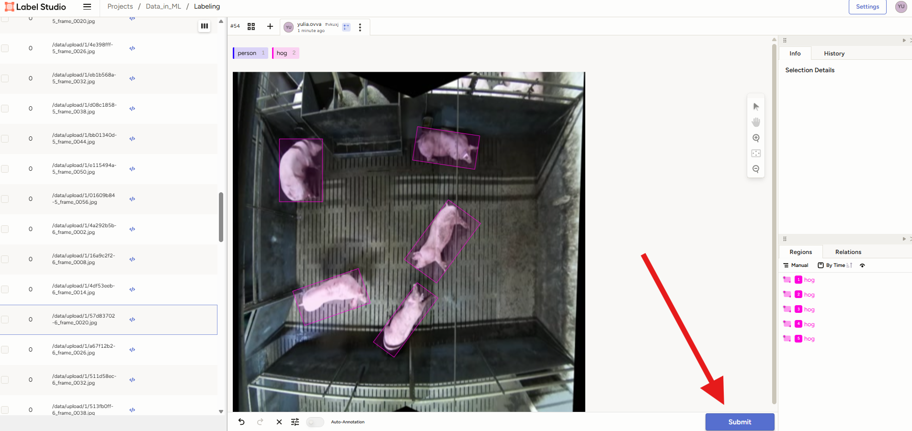

В данном датасете изображения довольно похожи, поэтому можно выделить всю разметку и скопировать ее на другие изображения, чтобы ускорить процесс разметки. Останется только подправить границы прямоугольников у объектов, которые поменяли местоположение.

Чтобы выделить все разметки, выберите стрелочку на боковой панели справа и с зажатым `Ctrl` выделите все прямоугольники. Затем нажмите `Ctrl+C` для копирования и `Ctrl+V` для вставки на другое изображение.

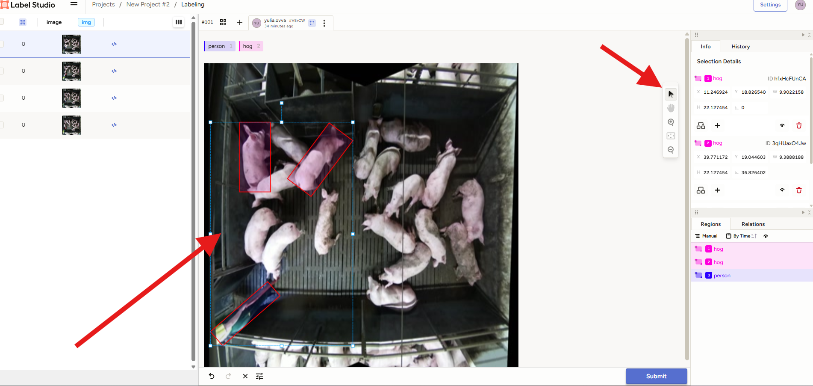

### 5. Выгрузка аннотаций

После завершения разметки всех изображений, выгрузите аннотации в формате `YOLO` через интерфейс Label Studio. Для этого перейдите в раздел проекта, нажмите на кнопку `Export`, выберите формат `YOLO` и еще раз нажмите `Export`. Файл с аннотациями будет загружен на ваш компьютер.

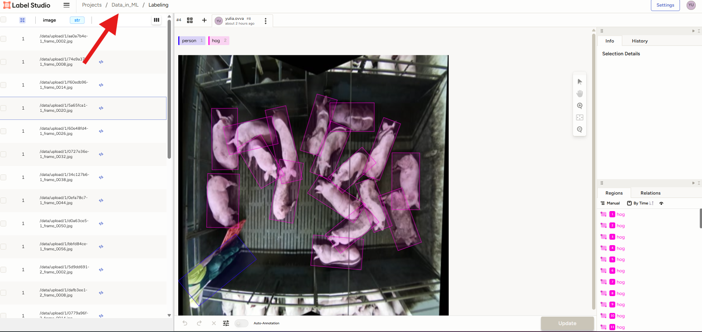

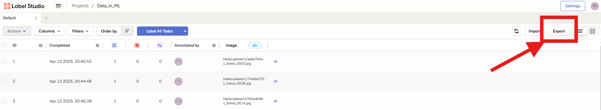

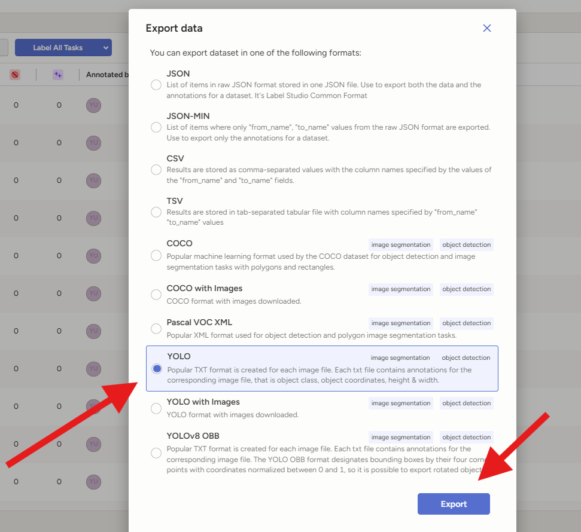


# Правила аннотации

1. Разметка должна быть сделана для двух классов:
   - `person` - синий цвет
   - `hog` - розовый цвет`

2. Границы прямоугольников должны как можно точнее обхватывать объект. Не бойтесь поварачивать прямоугольники и менять их границы.
3. Прямоугольники могут накладываться друг на друга.
4. Разметка должна быть выгружена в формате `YOLO`.

**ПРИМЕРЫ РАЗМЕТКИ:**
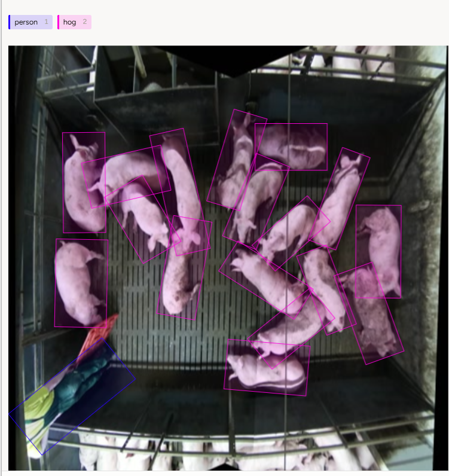
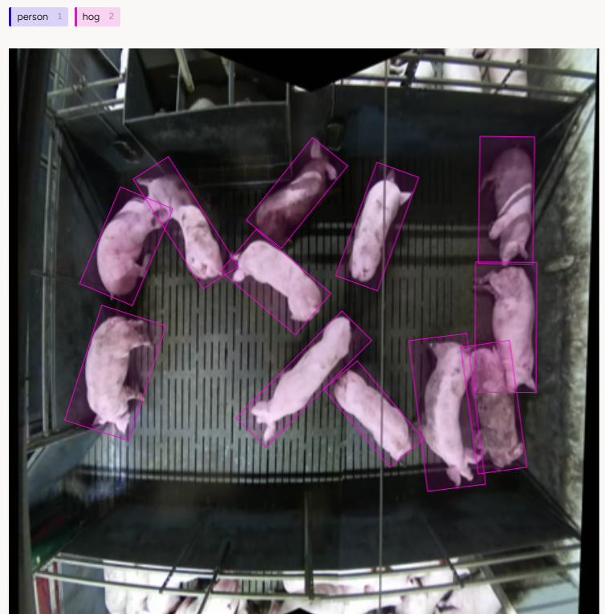

# Обратная связь

Если у вас есть вопросы, пожалуйста, напишите в телеграм: `@juliaju_o7`.
Также прошу оставить обратную связь о:
 - процессе разметки
 - сложностях, с которыми вы столкнулись
 - том, была ли понятна инструкция
 - что можно улучшить в постановке задачи


 Спасибо за вашу помощь! 😊